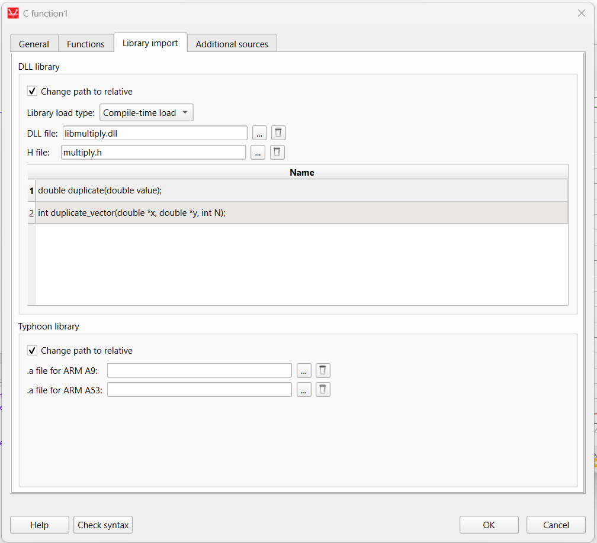
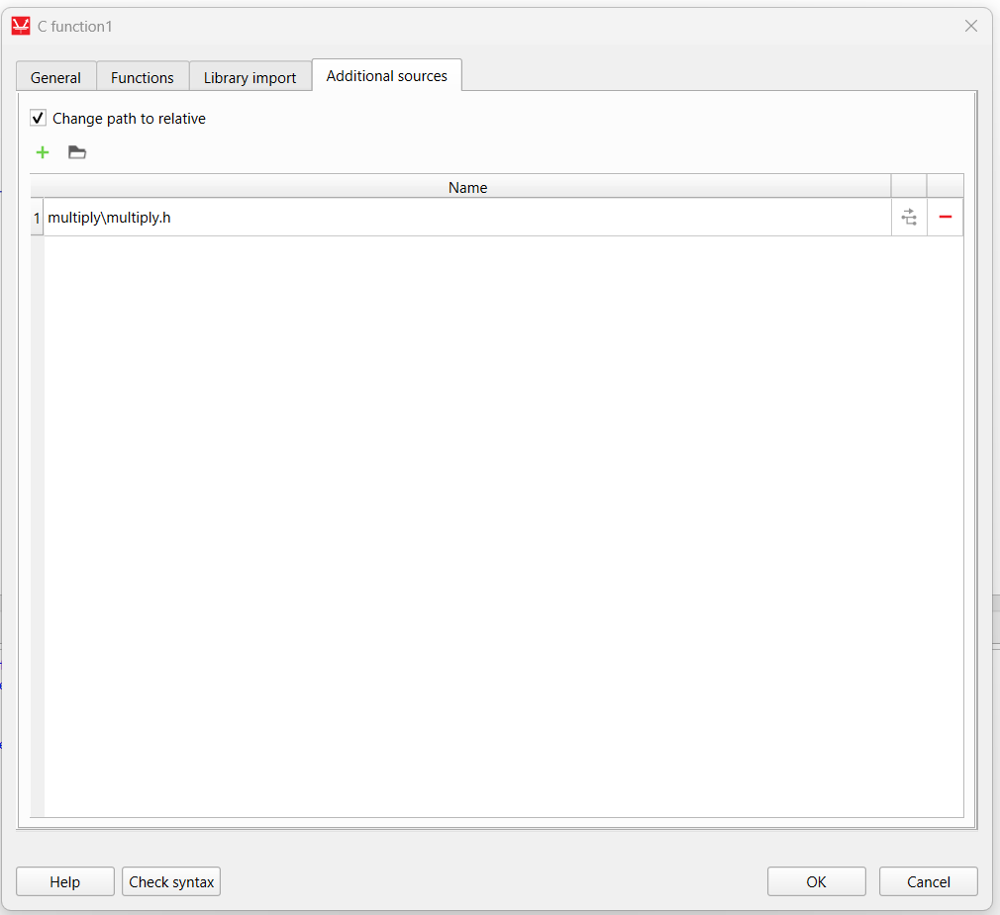
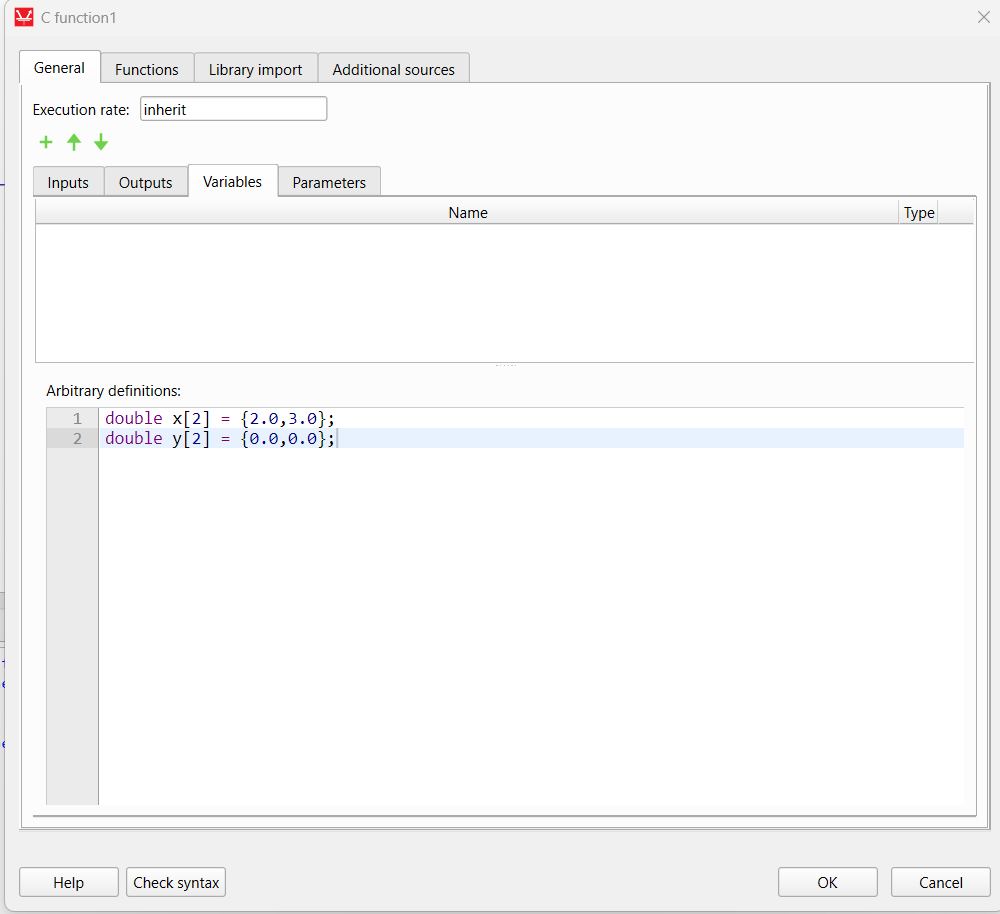
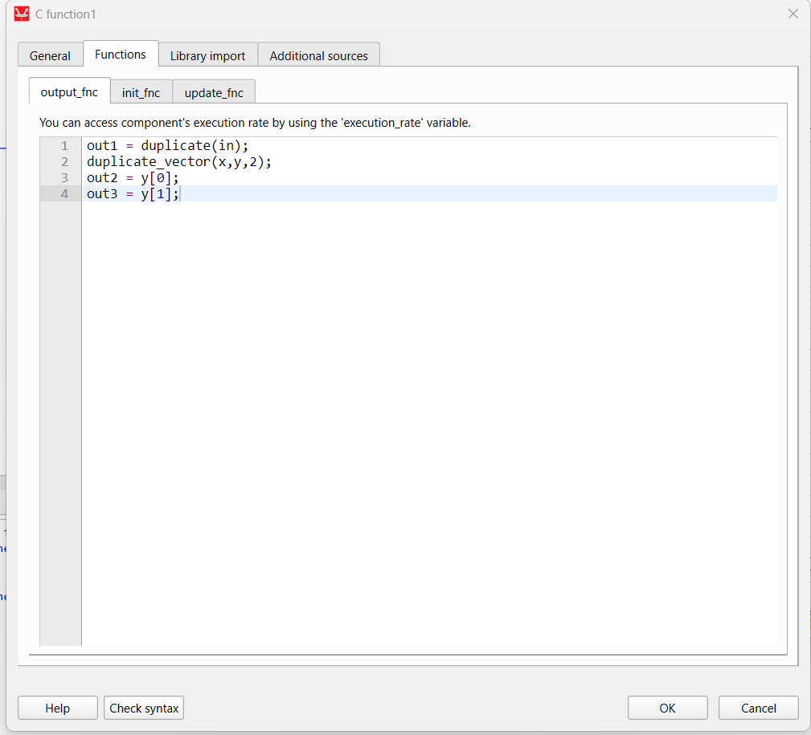

Open **Developer Command Prompt** and run:

   
    cd C:\Program Files\Typhoon HIL Control Center 2025.1\compilers\windows\z7\gnu\arm\nt\bin
    
    gcc -c -DBUILD_DLL c:\Users\jmmau\workspace\usemac\typhoon\machine_lut\machine_lut.c -o c:\Users\jmmau\workspace\usemac\typhoon\machine_lut\libmachinelut.o
    gcc -c -DBUILD_DLL c:\Users\jmmau\workspace\usemac\typhoon\machine_lut\machine.c -o c:\Users\jmmau\workspace\usemac\typhoon\machine_lut\libmachine.o
    gcc -c -DBUILD_DLL c:\Users\jmmau\workspace\usemac\typhoon\machine_lut\interpolations.c -o c:\Users\jmmau\workspace\usemac\typhoon\machine_lut\libinterpolations.o
    gcc -shared -o c:\Users\jmmau\workspace\usemac\typhoon\machine_lut\libmachinelut.dll c:\Users\jmmau\workspace\usemac\typhoon\machine_lut\libmachinelut.o c:\Users\jmmau\workspace\usemac\typhoon\machine_lut\libmachine.o c:\Users\jmmau\workspace\usemac\typhoon\machine_lut\libinterpolations.o -Wl,--out-implib,c:\Users\jmmau\workspace\usemac\typhoon\machine_lut\libmachinelut.a

 
 

# machine_lut

    arm-xilinx-eabi-gcc -Iinclude -c c:\Users\jmmau\workspace\usemac\typhoon\machine_lut\machine_lut.c -o c:\Users\jmmau\workspace\usemac\typhoon\machine_lut\libmachinelut.o
    arm-xilinx-eabi-gcc -Iinclude -c c:\Users\jmmau\workspace\usemac\typhoon\machine_lut\machine.c -o c:\Users\jmmau\workspace\usemac\typhoon\machine_lut\libmachine.o
    arm-xilinx-eabi-gcc -Iinclude -c c:\Users\jmmau\workspace\usemac\typhoon\machine_lut\interpolations.c -o c:\Users\jmmau\workspace\usemac\typhoon\machine_lut\libinterpolations.o
        aarch64-none-elf-ar rcs libexample_a53.a src\increment.o src\sub.o src\sum.o

    arm-xilinx-eabi-ar  rcs c:\Users\jmmau\workspace\usemac\typhoon\machine_lut\libmachinelut.a c:\Users\jmmau\workspace\usemac\typhoon\machine_lut\libmachinelut.o c:\Users\jmmau\workspace\usemac\typhoon\machine_lut\libmachine.o c:\Users\jmmau\workspace\usemac\typhoon\machine_lut\libinterpolations.o 